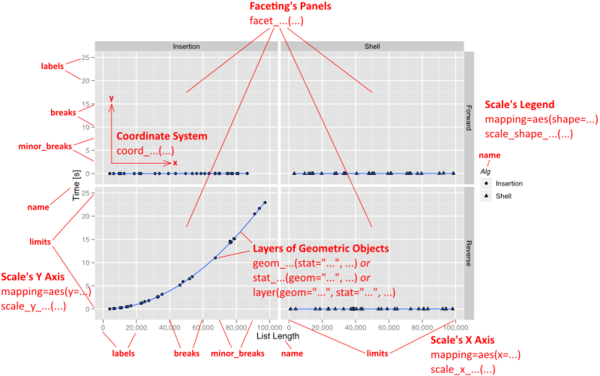

# Create graphs with Gplot2


Gplot2 is the most advanced module to generate graph in

To install it simply, execute:

```
install.packages("gplot2")
library(gplot2)

```

## Plot your data!!
A plot can contain an arbitrary number of layers.

Each layer uses a specific kind of statistic to summarize data, draws a specific kind of geometric object (geom) for each of the (statistically aggregated) data items, and uses a specific kind of position adjustment to deal with geoms that might visually obstruct each other.

Besides a list of layers, a plot also has a coordinate system, scales, and a faceting specification. These three aspects are shared among all layers in the plot.


## PART 3: Highly customized plots

A **plot** is defined by

* a coordinate system (coord),
* one or more scales (scale),
* an optional faceting specification (facet),
* and one or more layers (layer).


Each **layer** is then defined as

* an R data frame (data),
* a specification mapping columns of that frame into aesthetic properties (mapping),
* a statistical approach to summarize the rows of that frame (stat),
* a geometric object to visually represent that summary (geom),
* and an optional position adjustment to move overlapping geometric objects out of their way (position).

##  Decomposition of a graphic

The **"grammar of graphics"** can be summarized as follows:

```
-  plot ::= coord scale+ facet? layer+

-  layer ::= data mapping stat geom position?
```



## Example for an age pyramid

