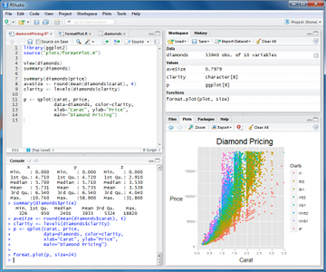
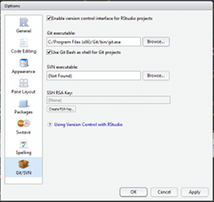

# Set up your environment

All tools presented in this book are using Open Source software (I personnally used almost exclusively Linux)

To set up your environement here are the step:

##   THE statistical language

   [R](http://en.wikipedia.org/wiki/R_(programming_language) is a free software programming language and a software environment for statistical computing and graphics. The first version of R has been released in 1997!

The capabilities of R are extended through **user-created packages**, which allow specialized statistical techniques, graphical devices, import/export capabilities, reporting tools.

A core set of packages is included with the installation of R. More than [5,800 additional packages](http://cran.r-project.org/web/packages/available_packages_by_date.html) and 120,000 functions (as of June 2014) are  developped and shared by academics and experts.

Using the right combination of package, you can integrate all steps necessary to data analysis into **scripts**:

 * Data management (clean, recode, merge, reshape)

 * Data analysis (plot, map, regression, multivariate analysis, etc...)

 * Writing up results (report and presentation generation)

## Installation of R and its interface

[install R](http://cran.r-project.org/) then install [Rstudio](http://www.rstudio.com/products/rstudio/)  

Rstudio is a graphical user interface to write R scripts. <i>In this tutorial, we will use Rstudio but you can also find alternatives such as [Rcommander](http://www.rcommander.com/) or [DeduceR](http://www.deducer.org/)</i>

Now you can add as [many packages](http://cran.r-project.org/web/packages/available_packages_by_date.html) as needed from the CRAN repository

##  **Collaborate** though "version control" with 

[Install Git](https://support.rstudio.com/hc/en-us/articles/200532077-Version-Control-with-Git-and-SVN), [Create your account](https://help.github.com/articles/signing-up-for-a-new-github-account) and [fork](https://help.github.com/articles/fork-a-repo) this [tutorial]()

Enable git in Rstudio (Tools>Global Options). You can now load the tutorial (File>New Projet>From Version control) as a project. All your edits will be now under version control!

## Collaborate: commit, push, pull

You can now [manage your R script in git](http://nicercode.github.io/git/rstudio.html) within the project in your account.

Afterwards, you can share back your contribution with the original author via [Pull Request](https://help.github.com/articles/using-pull-requests)

More details on [gitworkflow here](https://www.atlassian.com/git/workflows#!workflow-gitflow). Before starting any project, read this:
[Designing projects at Nice R Code](http://nicercode.github.io/blog/2013-04-05-projects/).

