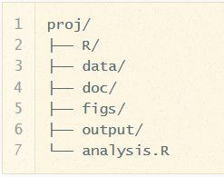
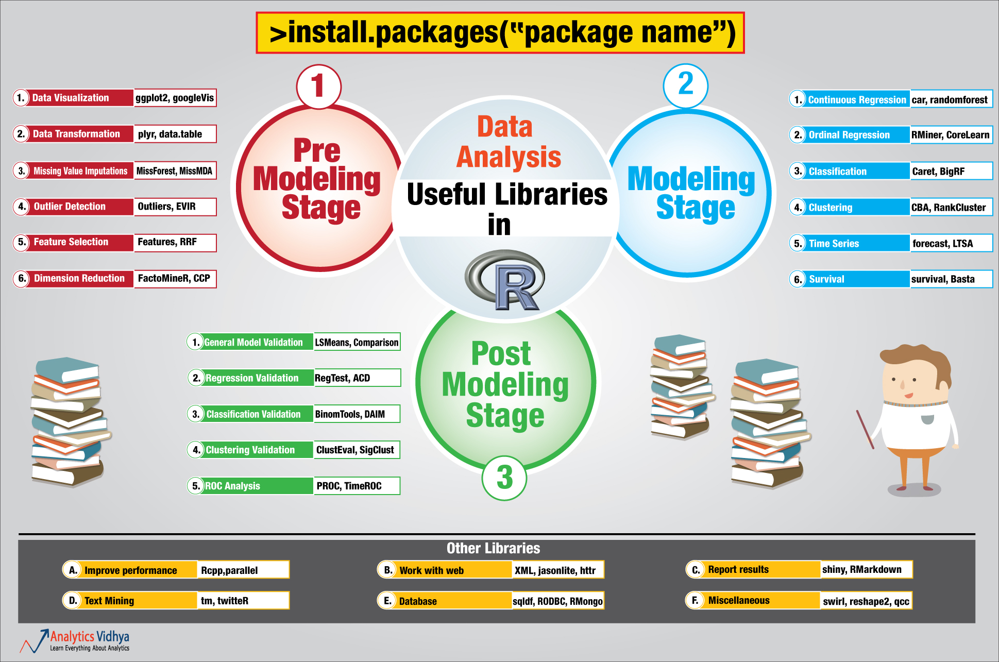
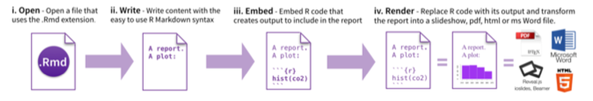

# Setting up reproducible data analysis workflow

--- #start

## An emerging profile...


For more, on the "humanitarian data scientist" profile concept, [see the article here.](http://blog.veritythink.com/post/105715607274/humanitarian-data-scientist-who-and-how). 

### This presentation an induction to a skill (Usage of R statistical language) that can support most of the steps of an analysis workflow. 
It contains plenty of [links](index.html#plan) that lead to additional ressources. 

--- #challenge

## ...to address new analysis challenges

With Mobile data collection, it's now easy to collect thousends of records for hundreds of variables... For instance, the "Refugees home visit survey"" in Jordan has 700 variables recorded on more than 70,000 observations!


-  ***Discover hidden patterns*** ; Hypothesis-based deductive reasoning only allows to confirm something known before while [patterns detection allows for inductive approaches](http://www.boozallen.com/media/file/The-Field-Guide-to-Data-Science.pdf). 
Exploratory analysis are required to identify multidiemsnional characteristics for instance if "*Is there a typology of individuals within this large population group*"


- ***Answer complex questions***: Univariate analysis provides too long reports. Multivariate analysis are required to address questions that includes the processing of multiple variables. Potentials questions could be:
"*What are the main factors attached to the occurrence of socio-economic vulnerability?*" or "*Is there a correlation between a certain type of violation and a specific profile within the population?*" or "*Can we identify individuals within a population with abnormal profiles ralted to the rest of the population?*"


--- #plan

## Presentation plan

 INTRO: Why using R?
[Reproducible research, environment installation](index.html#intro1)

 PART 1: Set up the software environment
[Installation of R, Rstudio, Git & Github](index.html#part1-1)

 PART 2: Manage data 
[Manipulating data](index.html#part2-1)

 PART 3: Produce graphics 
[Creating graphs](index.html#part3-1) 

 PART 4: Create Maps
[Mapping with R spatial packages](index.html#part4-1)

 PART 5:  Go further on data mining 
[Advanced Statistical analysis](index.html#part5-1)

 PART 6: Generate report and presentation
[Rmarkdown tags](index.html#part6-1)

--- .class2 #intro1 bg:lightgoldenrodyellow

## INTRO: A typical analysis path implies:

1. Associate data  with other tables with **ACCESS**  

2. then explore through graphs and eventually some VBA macros with **EXCEL**   

3. then mapping with **ArcGIS**  

4. then write up narratives in **WORD**   

4. and design a full document with  **INDESIGN**  

5. or create an infographics with  **ILLUSTRATOR**  

--- .class1 #intro2 bg:lightgoldenrodyellow

## INTRO: Issues with such workflow 

When managing numerous analysis and continuously changing dataset (like household survey), this workflow is **not** the most effective:


### Data are manipulated through "point-and-click" user interfaces!
### Data are exported / imported from a software to another (Excel, GIS, Word...) using different formats! 
### All results (figures, tables) are **manually** copied/pasted to the final publishing system...

> This consumes time and open space for errors...


--- .class1 #intro3 bg:lightgoldenrodyellow

## INTRO: When reviewing the analysis...

 - What analysis is **behind the figure**? Did it accounts for [...] in the analysis? 
 
 - Were **outliers** identified?

 - What **dataset** was used (e.g. final vs preliminary dataset)?

 - Oops, there is an error in the data. Can we **repeat the analysis**? And update quickly the figures, graphs and tables in the report and the presentation!

 - As a coauthor/reader, one would like to see the whole **research process** (how we arrived to that conclusion), rather than cooked manuscript with inserted tables/figures.

--- .class1 #intro4 bg:lightgoldenrodyellow

## INTRO:  Enabling a complete analysis workflow

As soon as all steps **DATA + ANALYSIS + PLOT + MAP + NARRATIVE** are done through **series of written command recorded in scripts** instead of **hundreds of mouse clicks**:

 - when spotting error in the data, or using different dataset, one just need to make changes in the script and report will update automatically;
 
 - Data management becomes be *de facto* fully documented (no more manual changes in Excel);

 - Analysis is documented and ready for any kind of collaborative review;

 - Customisation are facilitated and allow to deliver  final product  with a professional look'n'feel .
 
### Analysis becomes streamlined and [reproducible](http://muschellij2.github.io/summerR_2015/modules/module12.html)! 
### A "collaboration mode" is enabled from the begining of the process! 

--- .class1 #intro5 bg:lightgoldenrodyellow

## INTRO:  From "click" to "script"

Using the right combination of packages, you can integrate all necessary data analysis steps into **scripts**:

 * Data management (clean, recode, merge, reshape)

 * Data analysis (test, regression, multivariate analysis, etc...)
 
 * Data visualisation (plot, map, graph...)

 * Writing up results (report and presentation generation)


More on reproducible analysis [here](https://ropensci.github.io/reproducibility-guide/sections/introduction/)

--- .class1 #intro6 bg:lightgoldenrodyellow

## INTRO: The Reproducible Research Manisfesto

 1. For every result, **keep track** of how it was produced

 2. **Avoid manual data manipulation** steps

 3. **Archive** the exact versions of all external programs used

 4. **Version control** all custom scripts

 5. **Record all intermediate results**, when possible in standardized formats

 6. For analyses that include randomness, **note underlying random seeds**

 7. Always **store raw data** behind plots

 8. Generate hierarchical analysis output, allowing layers of increasing detail to be inspected

 9.  Connect **textual statements** to underlying results

 10. Provide **public access** to scripts, runs, and results

--- .class2 #part1-1 bg:lightblue

## PART 1: Why R?

   
 
 [Engineers tend to use Python over R](http://blog.datacamp.com/r-or-python-for-data-analysis/), but R remains the prefered language of statisticians who needs latest techniques & Algorythm. R can also be compared to [proprietary statistical software such as stata or SPSS](http://r4stats.com/blog) but has the advantage of being totally free to install & use. 

--- .class2 #part1-2 bg:lightblue

## PART 1: "THE" statistical language

   [R](http://www.r-project.org/) is a programming language and a software environment for statistical computing and graphics. The first version of R has been released in 1997! 

The capabilities of R are extended through **user-created packages**, which allow specialized statistical techniques, graphical devices, import/export capabilities, reporting tools. 

A core set of packages is included with the installation of R. More than [5,800 additional packages](http://cran.r-project.org/web/packages/available_packages_by_date.html) and 120,000 functions (as of June 2014) are  developped and shared by academics and experts.

R is extremely well documented. The best is to learn through [experience.. & more than 100,000 questions about R in stackoverflow](http://stackoverflow.com/questions/tagged/r) in addition of the numerous ressources to [learn R](http://www.ats.ucla.edu/stat/r/) from scratch as well as other [quick intro](http://www.ats.ucla.edu/stat/r/seminars/intro.htm). 


--- .class2 #part1-3 bg:lightblue

## PART 1:  Installation of R and its interface

[install R](http://cran.r-project.org/) then install [Rstudio](http://www.rstudio.com/products/rstudio/) <br>


 
Rstudio is a graphical user interface to write R scripts. <i>In this tutorial, we will use Rstudio but you can also find alternatives such as [Rcommander](http://www.rcommander.com/) or [DeduceR](http://www.deducer.org/)</i>

Now you can add as [many packages](http://cran.r-project.org/web/packages/available_packages_by_date.html) as needed from the CRAN repository

--- .class2 #part1-4 bg:lightblue

## PART 1: **Collaborate** through "version control" 

 

[Install Git](https://support.rstudio.com/hc/en-us/articles/200532077-Version-Control-with-Git-and-SVN), [Create your account](https://help.github.com/articles/signing-up-for-a-new-github-account) and [fork](https://help.github.com/articles/fork-a-repo) this [tutorial](https://github.com/Edouard-Legoupil/humanitaRian-data-science)

Enable git in Rstudio (Tools>Global Options). You can now load the tutorial (File>New Projet>From Version control) as a project. All your edits will be now under version control!


--- .class2 #part1-5 bg:lightblue

## PART 1: Collaborate: commit, push, pull

You can now [manage your R script in git](http://nicercode.github.io/git/rstudio.html) within the project in your account.

Afterwards, you can share back your contribution with the original author via [Pull Request](https://help.github.com/articles/using-pull-requests)


More details on [gitworkflow here](https://www.atlassian.com/git/workflows#!workflow-gitflow). 

--- .class3 #part2-1 bg:LightGray

## PART 2: Writing commands

 - ```R``` code can be entered directly into the command console or saved to a script.

 - Saved Scripts be run inside a session using  the ```source``` function
Commands are separated either by a ```;``` or by a newline.

 - ```R``` is case sensitive.

 - Use ```#``` character at the beginning of a line to insert non executed comments
 
 - Wide range of [functions](http://adv-r.had.co.nz/Vocabulary.html). Help by preceding the name of the function with ```?``` (e.g. ```?require```).

 - Data, functions and output are assigned and stored as ***objects*** using the ```<-``` or ```=``` operator
  


When writing commands, it's good to adopt a [consistent Coding convention](http://google-styleguide.googlecode.com/svn/trunk/Rguide.xml). When writing script, be consistent in your [style](https://leanpub.com/datastyle). When starting a project, to organised files/folders around a [consistent logic](http://nicercode.github.io/blog/2013-04-05-projects/). 


--- .class3 #part2-2 bg:LightGray

## PART 2: Objects & Data elements

-  `Vectors` are a core data structure in R, and are created with `c()`. Elements in a vector must be of the same type.

-  `Data.frame` where each column is a vector, but adjacent vectors can hold different things

- `Matrix` just like a data frame except it's all numeric

- `List` are made of any dimension, mix and match

- `Factors` are a special class that R uses for categorical variables, which also allows for value labeling and ordering.

Reference link on [Manipulating data](http://www.cookbook-r.com/Manipulating_data/)

--- .class3 #part2-3 bg:LightGray

## PART 2: Vector Example


```r
  numbers = c(23, 13, 5, 7, 31)
  names = c("mohammed", "hussein", "ali")

#Elements are indexed starting at 1, and are accessed with `[]` notation.
	numbers[1] # 23
	names[1] # mohammed
```

--- .class3 #part2-4 bg:LightGray 

## PART 2: Data frames
[Data frames](http://www.r-tutor.com/r-introduction/data-frame)


```r
    books = data.frame(
        title = c("harry potter", "war and peace", "lord of the rings"),
        author = c("rowling", "tolstoy", "tolkien"),
        num_pages = c("350", "875", "500")
    )

# you can access columns of a data frame with `$`.
	books$title # c("harry potter", "war and peace", "lord of the rings")
	books$author[1] # "rowling"

#You can also create new columns with `$`.
	books$num_bought_today = c(10, 5, 8)
	books$num_bought_yesterday = c(18, 13, 20)
	books$total_num_bought = books$num_bought_today + books$num_bought_yesterday
```

--- .class3 #part2-5 bg:LightGray

## PART 2: Load a Data Frame


```r
data(CASchools)
mydata <- CASchools

# load a data set from csv and assign it to an object called 'mydata'
#mydata <- read.csv("unhcr_mass_comm_db_merged_20140612.csv") 

# first few rows of the dataset
head(mydata)

# last few rows
tail(mydata)

# variable names
colnames(mydata)

# pop-up view of entire data set (uncomment to run)
# View(mydata)
```

--- .class3 #part2-6 bg:LightGray

## PART 2: Initial Exploration


```r
# dimension of the data frame
dim(mydata)

# Structure of the data frame of all variables
# this includes the class(type) i.e factor or not
str(mydata)

# summary statistics with means for every variable
summary(mydata)
```

--- .class3 #part2-7 bg:LightGray

## PART 2: View Data


```r
# single cell value
mydata[2,3]

# omitting row value implies all rows; here all rows in column 3
mydata[,3]

# omitting column values implies all columns; here all columns in row 2
mydata[2,]

# can also use ranges - rows 2 and 3, columns 2 and 3
mydata[2:3, 2:3]

# get first 10 rows of variable female using two methods
mydata[1:10, "female"]
mydata$female[1:10]

# get column 1 for rows 1, 3 and 5
mydata[c(1,3,5), 1]

# get row 1 values for variables female, prog and socst
mydata[1,c("female", "prog", "socst")]

# sort data using the order function.
sorteddata <- mydatad[order(d$id, d$female), ]
```

--- .class3 #part2-8 bg:LightGray

## PART 2: Data Cleaning


```r
## cleaning Geneder variable encoding
data$gender[data$gender %in%  c("Male", "M", "m")] <- "Male"

# creating a date for sorting
circ$date <- as.Date(circ$date, "%m/%d/%Y") 
```

Useful String functions

* `toupper()`, `tolower()` - uppercase or lowercase your data:
* `str_trim()` (in the `stringr` package) - will trim whitespace
* `nchar` - get the number of characters in a string
* `substr(x, start, stop)` - substrings from position start to position stop
* `strsplit(x, split)` - splits strings up - returns list!
* `paste()` - paste strings together - look at `?paste`

[More on cleaning here](http://muschellij2.github.io/summerR_2015/modules/module9.html)

--- .class3 #part2-9 bg:LightGray

## PART 2: Subsetting Variables
Often, datasets come with many more variable than we want. We can also use subset to keep only the variables we need.

We can use  the select argument to subset by variable rather than by observation.


```r
# select is special, so we do not need to quote the variable names
mydataselect <- subset(mydata, select = c(id, female, read, write))

# the - preceding c(female... , which means drop these variables
mydatadropped <- subset(mydata, select = -c(female, read, write))
```

--- .class3 #part2-10 bg:LightGray

## PART 2: Merging 2 Data Frames

 * It is done through the function merge

 * Merging is the equivalent of a join in SQL (and supports natural natural and outer joins)


```r
# LEFT JOIN using different ID
datamerged <- merge(x=data1, y=data2, by.x="id1", by.y="id2", all.x=TRUE )

# RIGHT JOIN using ID who have the same name in both dataframe
datamerged <- merge(x=data1, y=data2, by="id", all.y=TRUE )

# OUTER JOIN using two variables
datamerged <- merge(x=data1, y=data2, by=c("caseid","name"), all=TRUE )
```

--- .class3 #part2-11 bg:LightGray

## PART 2: Reshaping Data

A common operation is the transformation between wide and long data. 
This is basically the equivalent of **pivot table** in Excel or a **cross tab query** in Access.

 - **Wide** - multiple measurements are variables / columns so that the data gets wider with more measurements
 - **Long** - multiple measurements are rows so data gets longer with more measurements. One example would be many ids with multiple visits. Long-format data isn’t necessarily only two columns. 

The corresponding functions (melt and cast) are in the **reshape2** packages is based around two key functions: 


```r
install.packages("reshape2") ## install the package in you station - do it only once
library("reshape2") ## load the package in your session

#melt takes wide-format data and melts it into long-format data.
data.training <- melt(data, id=c(9), measure=c(12:14))

#cast takes long-format data and casts it into wide-format data.
data.training.summary <- dcast(data.training, variable ~ value )
```

More [info here] (http://www.r-bloggers.com/data-manipulation-with-reshape2/)

--- .class4 #part3-1 bg:lightgreen

## PART 3:  Plot Data


A plot can contain an arbitrary number of layers. 

Each layer uses a specific kind of statistic to summarize data, draws a specific kind of geometric object (geom) for each of the (statistically aggregated) data items, and uses a specific kind of position adjustment to deal with geoms that might visually obstruct each other.

Besides a list of layers, a plot also has a coordinate system, scales, and a faceting specification. These three aspects are shared among all layers in the plot. 

You can [create basic graphs with the core R](http://www.cookbook-r.com/Graphs/) but the  [Gplot2 package](http://docs.ggplot2.org/current/) is the way to produce advanced graphs.

--- .class4 #part3-2 bg:lightgreen

## PART 3: Decomposition of a Graphic

The **"grammar of graphics"** is a [conceptual description](https://ramnathv.github.io/pycon2014-r/visualize/ggplot2.html) of all potential graphs. It can be summarized as follows:

```
-  plot ::= coord scale+ facet? layer+

-  layer ::= data mapping stat geom position?
```
 

--- .class4 #part3-3 bg:lightgreen

## PART 3: Highly customized plots

With ggplot2, a **plot** is defined through the following variables: 

 * ### a coordinate system (**coord**),

 * ### one or more scales (**scale**),

 * ### an optional faceting specification (**facet**),

 * ### and one or more layers (**layer**). 


A **layer** is then defined as

 * ### a linked R data frame (**data**), 

 * ### a specification mapping columns of that frame into aesthetic properties (**mapping**),

 * ### a statistical approach to summarize the rows of that frame (**stat**),

 * ### a geometric object to visually represent that summary (**geom**),

 * ### and an optional position adjustment to move overlapping geometric objects out of their way (**position**).


--- .class4 #part3-4 bg:lightgreen

## PART 3: Example for an age pyramid
[R cookbook - colors with Gplot2](http://www.cookbook-r.com/Graphs/Colors_(ggplot2)

[Gplot2 tutorial](http://sape.inf.usi.ch/quick-reference/ggplot2)


--- .class5 #part4-1 bg:MintCream 

## PART 4: Create Maps

[Creating maps in R](https://github.com/Robinlovelace/Creating-maps-in-R)

R offers a large [number of packages to deal with spatial data](http://cran.r-project.org/web/views/Spatial.html). A really good [tutorial is here](https://raw.githubusercontent.com/Robinlovelace/Creating-maps-in-R/master/intro-spatial-rl.pdf)


```r
## Using the Spatial & GDAL library 
library("sp")
library("rgdal")

## reading a shapefile and converting it into a 'spatialdataframe
jordanmap <- readOGR (dsn = "data" , layer = "jordan")

## We can now display the map as a plot with core R function
plot(jordanmap)
```

--- .class5 #part4-2 bg:MintCream 

## PART 4: Thematic Mapping

One approach is to approach maps as if they were plots and use the same [ggplot2 package to produce map](http://spatial.ly/2013/12/introduction-spatial-data-ggplot2/).


```r
library("ggplot2")
## to use the spatial dataframe with ggplot2, we need first to 'fortity' it


## then we can simply create the plot
```

--- .class5 #part4-3 bg:MintCream 

## PART 4: Spatial analysis

An interesting application of using R is to retrieve bioclimatic information for winterisation analysis. For instance, we have a list of IDP locations with coordinates for which [bioclim variables](http://www.worldclim.org/) (such as BIO5 = Max Temperature of Warmest Month, BIO6 = Min Temperature of Coldest Month, BIO10 = Mean Temperature of Warmest Quarter, BIO11 = Mean Temperature of Coldest Quarter, BIO13 = Precipitation of Wettest Month, BIO19 = Precipitation of Coldest Quarter). Tiles can be [downloaded as geotiff](http://www.worldclim.org/tiles.php)


```r
library("raster")
library("sp")
bio5 <- raster("data/shp/bio5_17.tif", native = T)
bio6 <- raster("data/shp/bio6_17.tif", native = T)
bioall <- stack(bio5, bio6)

## Converting the dataframe containing idp site in a spatial dataframe
coordinates(idpsite) <- c("Longitude", "Latitude")

## Extracting now the bio variables for each coordinates
idpsite.bioall <- extract(bioall, masterloc, df = TRUE)


## Then classifying the temperatures in order to get statistics
library("classint")

idpsite.bioall$maxtemp <- as.factor(findCols(classIntervals(idpsite.bioall$bio5_17/10, n = 11, style = "fixed", fixedBreaks = c(-10, -5, 0, 5, 10, 15, 20, 25, 30, 35, 40, 45, 50, 55))))

## Renaming categories
idpsite.bioall$maxtemp <- revalue(idpsite.bioall$maxtemp, c(`1` = "-10 to -5°C", `2` = "-5 to 0°C", `3` = "0 to 5°C", `4` = "5 to 10°C", `5` = "10 to 15°C",  `6` = "15 to 20°C", `7` = "20 to 25°C", `8` = "25 to 30°C", `9` = "30 to 35°C", `10` = "35 to 40°C", `11` = "40 to 45°C", `12` = "45 to 50°C", `13` = "50 to 55°C"))
```

[See a practical example here](https://github.com/unhcr-iraq/dtm-analysis/blob/gh-pages/code/climate.R)

--- .class6 #part4-4 bg:lightsilver

## PART 4: Redistricting

Analytical regionalization (also known as Redisticting or spatially constrained clustering) is a scientific way to decide how to group a large number of geographic areas or points into a smaller number of regions based on similarities in one or more variables (i.e.: refugee numbers, numbers of site, environmental condition, etc.). 


An intial point can be to convert point data into polygons that will be then aggregated togehter to form the operational region. A [vornoipolygon](http://stackoverflow.com/questions/12156475/combine-voronoi-polygons-and-maps) function can be created. 

```r
idpsite.in.district <- voronoipolygons(idpsite,district)
## Let's allocate the right Spatial Reference System Identifier (SRID)
proj4string(idpsite.in.district) <- '+proj=longlat'
## we can now save the out put as a shapefile
writeOGR(vorototal,"out","idpsite.in.district",driver="ESRI Shapefile", overwrite_layer=TRUE)
```

An open source library of [spatially constrained clustering algorithms](http://www.rise-group.org/risem/clusterpy/index.html) is avaialble in Python


```r
library(rPython)
# Load/run the main Python script
python.load("regionalise.py")
```

[Creating Voronoi polygons](https://github.com/unhcr-iraq/cccm-assessment/blob/master/voronoi.R)

--- .class6 #part5-1 bg:lightsilver

## PART 5: Linear Regression 

A regression is used when one is trying to predict the value of a variable using other variables.
A simple use case is to  observe expenditure per capita through household surveys among a sample of refugees and then to predict the same expenditure per capita on the whole registered refugee population.

```r
## Companion to Applied Regression
library("CAR") 

## calculate a regression with lm function of the expenditure per capita observed in a sample 
## but using variables recorded through registration. For the regression, variables are converted to binary versions. 
regression <- lm(expenditure.percapita ~
                    gender.male + case.size.2 + case.size.3plus + child.grp2 + child.grp3plus + mar_single + mar_married +  edu.highest.grp1 + edu.highest.grp2, 
               data= sample.householdsurvey)

## analyse the result of the regression:
summary(regression)

## Checking the validity of the model - i.e. residuals follow a "normal"
hist(resid(regression))

## Now given that the smae exact variable are present in both 'sample.householdsurvey' & 'data.registration'
## we can calculate the predicted expenditure per capita on all registered refugees and assign it in the variable 'prediction' within the data frame 'data.registration'      
data.registration$prediction <- predict(regression, newdata=data.registration)
```
See a practical example in the [VAF project](https://github.com/unhcr-jordan/vaf/blob/master/code/analytic_code/2_Welfare-Model_ProGres_only.R).

More on advanced statistical analysis [here](http://www.cookbook-r.com/Statistical_analysis/).

--- .class6 #part5-2 bg:lightsilver

## PART 5: 9 others Common Prediction Algorythms (1/4)

See also [presentation of common machine learning algorythm](http://www.analyticsvidhya.com/blog/2015/08/common-machine-learning-algorithms/). 

### Logistic Regression


```r
## Load Train and Test datasets
## Identify feature and response variable(s) and values must be numeric and numpy arrays
x_train <- input_variables_values_training_datasets
y_train <- target_variables_values_training_datasets
x_test <- input_variables_values_test_datasets
x <- cbind(x_train,y_train)
## Train the model using the training sets and check score
logistic <- glm(y_train ~ ., data = x,family='binomial')
summary(logistic)
## Predict Output
predicted= predict(logistic,x_test)
```

### Decision Tree

```r
library(rpart)
x <- cbind(x_train,y_train)
## Grow tree 
fit <- rpart(y_train ~ ., data = x,method="class")
summary(fit)
## Predict Output 
predicted= predict(fit,x_test)
```

--- .class6 #part5-3 bg:lightsilver

## PART 5: 9 others Common Prediction Algorythms (2/4)

### SVM (Support Vector Machine)


```r
library(e1071)
x <- cbind(x_train,y_train)
# Fitting model
fit <-svm(y_train ~ ., data = x)
summary(fit)
#Predict Output 
predicted= predict(fit,x_test)
```

### Naive Bayes


```r
library(rpart)
x <- cbind(x_train,y_train)
## grow tree 
fit <- rpart(y_train ~ ., data = x,method="class")
summary(fit)
## Predict Output 
predicted= predict(fit,x_test)
```

--- .class6 #part5-5 bg:lightsilver

## PART 5: 9 others Common Prediction Algorythm  (3/4)

### KNN (K- Nearest Neighbors)


```r
library(knn)
x <- cbind(x_train,y_train)
## Fitting model
fit <-knn(y_train ~ ., data = x,k=5)
summary(fit)
## Predict Output 
predicted= predict(fit,x_test)
```

### K-Means

```r
library(cluster)
fit <- kmeans(X, 3) # 5 cluster solution
```

### Random Forest


```r
library(randomForest)
x <- cbind(x_train,y_train)
## Fitting model
fit <- randomForest(Species ~ ., x,ntree=500)
summary(fit)
## Predict Output 
predicted= predict(fit,x_test)
```

--- .class6 #part5-6 bg:lightsilver

## PART 5: 9 others Common Prediction Algorythm  (4/4)

### Dimensionality Reduction Algorithms


```r
library(stats)
pca <- princomp(train, cor = TRUE)
train_reduced  <- predict(pca,train)
test_reduced  <- predict(pca,test)
```

### Gradient Boosting & AdaBoost

```r
library(caret)
x <- cbind(x_train,y_train)
## Fitting model
fitControl <- trainControl( method = "repeatedcv", number = 4, repeats = 4)
fit <- train(y ~ ., data = x, method = "gbm", trControl = fitControl,verbose = FALSE)
predicted= predict(fit,x_test,type= "prob")[,2] 
```

--- .class6 #part5-7  bg:lightsilver

## PART 5: Multivariate Analysis & Clustering
Those techniques are used when trying to analyse together multiple variables in order to define statistical proximity betwene individuals. Multiple Correspondence Analysis (MCA) is used for qualitative data and Principal Component Analysis (PCA) is used for quantitative data.


```r
require(FactoMineR)
## We subset only the variables we want to analyse
registration.subset <- data.registration[,c("gender","case.size","occuation","education","child.num","coolevel1")]
registration.mca = MCA(registration.subset)
## Now we can get a description of the 2 composite descriptive componnent
dimdesc(registration.mca)
## Another step is to perform Hierarchical Clustering on Principal Components
res.hcpc = HCPC(registration.mca)
## The description of the resulting clusters is available through the following command
registration.hcpc$desc.var
registration.hcpc$desc.axes
registration.hcpc$desc.ind
```

There are various packages to perform MCA, [more about this here](http://gastonsanchez.com/blog/how-to/2012/10/13/MCA-in-R.html). The [Hierarchical Clustering on Principal Components technique is described here](http://factominer.free.fr/classical-methods/hierarchical-clustering-on-principal-components.html)

--- .class6 #part5-8  bg:lightsilver

## PART 5: A large choice of packages



--- .class7 #part6-1 bg:Moccasin  

## PART 6: Generate Reports

From RStudio, create a [Rmarkdown file](http://www.rstudio.com/ide/docs/authoring/markdown_notebooks), insert your code chunk and render it to get the output in the requested format.




Have a look at the [cheatsheet](http://shiny.rstudio.com/images/rm-cheatsheet.png), a [tutorial](http://pakillo.github.io/Rmarkdown_tutorial) as well as the [docs](http://www.rstudio.com/ide/docs/authoring/using_markdown).


--- .class7 #part6-2 bg:Moccasin

## PART 6: Generate Presentation
This can be down using  Rmarkdown and the [Slidify package](http://slidify.org/) or
This presentation is generated using R.


```r
## Devtols is required to load packages from Github 
require(devtools) 

## Then install slidify
install_github("slidify", "ramnathv")
install_github("slidifyLibraries", "ramnathv")

## load the library
library(slidify)

## generates a folder where your presentation will be created
author("slides") 

## and simply convert Rmardown to html presentation
slidify("slides/index.Rmd") 
```


Alternatively, insert your [R visualisation directly in powerpoint](http://www.r-bloggers.com/programmatically-create-interactive-powerpoint-slides-with-r/)

--- .class6 #part6-3 bg:lightsilver

## PART 6: Dynamic datavisualisation 
Use the [Rmaps](http://rmaps.github.io/) & [Rcharts](http://rcharts.io/gallery/) packages. Those packages provide interface between R and popular Javascript libraries like [Crossfilter](http://square.github.io/crossfilter/) (multidimensional exploration), [d3.js](http://d3js.org/), [Polychart](http://www.polychartjs.com/), [Highchart](http://www.highcharts.com/), (datavisualisation) or [Leaflet.js](http://leafletjs.com/) (webmapping).


```r
#Install the libraries
require(devtools)
install_github('ramnathv/rCharts@dev')
install_github('ramnathv/rMaps')
library("rCharts")
library("rMaps")
```

Another options is [PlotLy](https://plot.ly/r/). The advantage is that it's based on ggplot2. Multiple complex plots can also be arranged together in a [dashboard](https://plot.ly/r/dashboard/).


```r
library(plotly)
# Create a graph throughh ggplot2
p <- ggplot(data = d, aes(x = carat, y = price)) +
  geom_point(aes(text = paste("Clarity:", clarity)), size = 4) +
  geom_smooth(aes(colour = cut, fill = cut)) + facet_wrap(~ cut)
# Convert it to an interactive one
(gg <- ggplotly(p))
```

--- #cl-1 bg:yellow

## Conclusion

A personal investment

>  It takes a bit of time to learn at the begining but it will save you time in the long run!

An opportunity to remain at the edge of current technologies
> If you don't move forward, you are likely already moving backward...

To further learn, consult for instance the [index of Online R Courses as of October 2015](http://www.r-bloggers.com/learning-r-index-of-online-r-courses-october-2015/) or start by reading this [book](http://file.allitebooks.com/20150911/R%20in%20Action,%20Second%20Edition.pdf).


--- #cl-2 bg:yellow

## Some projects

 * [Iraq Displacement Tracking Matrix Analysis](https://github.com/unhcr-iraq/dtm-analysis)
 * [Jordan ActivityInfo extraction](https://github.com/unhcr-jordan/activityinfo)
 * [Jordan Vulnerability Assessment Framework](https://github.com/unhcr-jordan/vaf)

Check this work-in-progress [tutorial on HumanitaRian Data Science](https://github.com/Edouard-Legoupil/humanitaRian-data-science). 


*Last food for thought*:

> Authorship credit is too often absent from corporate and government reports; we should remember that people do things, not agencies, bureaus, departments, divisions.

> <cite>[Beautiful Evidence](http://www.edwardtufte.com/tufte/books_be), Edward Tufte  </cite>
 
Use R, share and showcase your projects on github & [get them referenced here](https://github.com/Edouard-Legoupil/humanitaRian-data-science/issues/new) 


