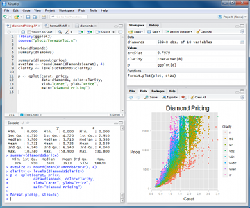

---
title: "Advanced tool for better analysis: How to set up an analysis workflow with R?"
author: "Edouard legoupil, Snr Information Management Officer, UNHCR MENA"
date: "12 October 2015"
output:
  slidy_presentation:
    highlight: pygments
    footer: "HumanitaRian Data Scientist"

--- bg:yellow

## Presentation plan

# INTRO: Why using R?
[Reproducible research, installation](#3)

# PART 1: Set up the software environment
[Installation of R, Rstudio, Git & Github](#8)

# PART 2: Manage data 
[Manipulating data](#12)

# PART 3: Produce graphics 
[Creating graphs](#22) 

# PART 4: Create Maps
[Mapping with R spatial packages](#25)

# PART 5: Generate report and presentation
[Rmarkdown tags](#25)

# PART 6:  Go further on data mining 
[Advanced Statistical analysis](#26)

--- .class1 #id1 bg:lightgoldenrodyellow

## INTRO: A typical analysis path implies:

1. Manage data: cleaning, reformatting  with **EXCEL**   ;

2. Analysis: produce graphs with **EXCEL**   and maps with **ArcGIS**  ;

3. Write up to publish in **WORD**   , **PUBLISHER**  or **INDESIGN**  .

--- .class1 #id1 bg:lightgoldenrodyellow

## INTRO: Issues with such worflow 

When managing numerous analysis, this workflow is **not** the most effective:

- Data are manipulated through "point-and-click user interfaces"...

- Data are sent from a software to another (Excel, GIS, Word...) using different formats!

- All results (figures, tables) are **manually** imported to the final publishing system...


--- .class1 #id1 bg:lightgoldenrodyellow

## INTRO: Reviewing the analysis

- What analysis is **behind the figure**? Did it accounts for [...] in the analysis?

- What **dataset** was used (e.g. final vs preliminary dataset)?

- Oops, there is an error in the data. Can we **repeat the analysis**? And update quickly the figures, graphs and tables in the report and the presentation!

- As a coauthor/reader, one would like to see the whole **research process** (how we arrived to that conclusion), rather than cooked manuscript with inserted tables/figures.

--- .class1 #id1 bg:lightgoldenrodyellow

## INTRO: Reproducible Research

 1. For every result, **keep track** of how it was produced

 2. **Avoid manual data manipulation** steps

 3. **Archive** the exact versions of all external programs used

 4. **Version control** all custom scripts

 5. **Record all intermediate results**, when possible in standardized formats

 6. For analyses that include randomness, **note underlying random seeds**

 7. Always **store raw data** behind plots

 8. Generate hierarchical analysis output, allowing layers of increasing detail to be inspected

 9.  Connect **textual statements** to underlying results

 10. Provide **public access** to scripts, runs, and results

--- .class1 #id1 bg:lightgoldenrodyellow

## INTRO:  Enabling a complete analysis workflow

Rather than through "clicking", all steps DATA + ANALYSIS + PLOT + MAP + NARRATIVE should rather be written in a few script:

 - If spotting error in the data, or using different dataset, make changes in the script and report will update automatically;
 
 - Data management will be *de facto* fully documented (no more manual changes in Excel);

 - Analysis would as well be documented and will be ready for any kind of collaborative review;

 - Plenty of customisation options will be available and will give a professional look and feel to the final product.
 
### Analysis becomes streamlined and reproducible! ###
### A "collaboration mode" is enabled from the begining of the process! ###


--- .class2 #id2 bg:lightblue

## PART 1: The   statistical language

   [R](http://www.r-project.org/) is a free software programming language and a software environment for statistical computing and graphics. The first version of R has been released in 1997!

The capabilities of R are extended through **user-created packages**, which allow specialized statistical techniques, graphical devices, import/export capabilities, reporting tools. 

A core set of packages is included with the installation of R. More than [5,800 additional packages](http://cran.r-project.org/web/packages/available_packages_by_date.html) and 120,000 functions (as of June 2014) are  developped and shared by academics and experts.

[Ressources to learn R](http://www.ats.ucla.edu/stat/r/) as well as a nice [intro](http://www.ats.ucla.edu/stat/r/seminars/intro.htm) 

--- .class2 #id2 bg:lightblue

## PART 1:  From "click" to "script"

Using the right combination of packages, you can integrate all necessary data analysis steps into **scripts**:

 * Data management (clean, recode, merge, reshape)

 * Data analysis (plot, map, regression, multivariate analysis, etc...)

 * Writing up results (report and presentation generation)


--- .class2 #id2 bg:lightblue

## PART 1:  Installation of R and its interface

[install R](http://cran.r-project.org/) then install [Rstudio](http://www.rstudio.com/products/rstudio/) <br>


 
Rstudio is a graphical user interface to write R scripts. <i>In this tutorial, we will use Rstudio but you can also find alternatives such as [Rcommander](http://www.rcommander.com/) or [DeduceR](http://www.deducer.org/)</i>

Now you can add as [many packages](http://cran.r-project.org/web/packages/available_packages_by_date.html) as needed from the CRAN repository

--- .class2 #id2 bg:lightblue

## PART 1: **Collaborate** though "version control" with  

[Install Git](https://support.rstudio.com/hc/en-us/articles/200532077-Version-Control-with-Git-and-SVN), [Create your account](https://help.github.com/articles/signing-up-for-a-new-github-account) and [fork](https://help.github.com/articles/fork-a-repo) this [tutorial]()

Enable git in Rstudio (Tools>Global Options). You can now load the tutorial (File>New Projet>From Version control) as a project. All your edits will be now under version control!


--- .class2 #id2 bg:lightblue

## PART 1: Collaborate: commit, push, pull

You can now [manage your R script in git](http://nicercode.github.io/git/rstudio.html) within the project in your account.

Afterwards, you can share back your contribution with the original author via [Pull Request](https://help.github.com/articles/using-pull-requests)


More details on [gitworkflow here](https://www.atlassian.com/git/workflows#!workflow-gitflow). Before starting any project, read this: 
[Designing projects at Nice R Code](http://nicercode.github.io/blog/2013-04-05-projects/).

--- .class3 #id3 bg:LightGray

## PART 2: Writing commands

```R``` code can be entered into the command line directly or saved to a script, which can be run inside a session using  the ```source``` function
Commands are separated either by a ```;``` or by a newline.
```R``` is case sensitive.

The ```#``` character at the beginning of a line signifies
  a comment, which is not executed.
Help files for R functions are accessed by preceding the name of the function with ```?``` (e.g. ```?require```).


```R``` stores both data and output from data analysis (as well as
  everything else) in objects. Things are assigned to and stored in objects using
  the ```<-``` or ```=``` operator
  
A list of all objects in the current session can be obtained by ``` ls() ```


--- .class3 #id3 bg:LightGray

## PART 2: Objects & Data elements

[Manipulating data](http://www.cookbook-r.com/Manipulating_data/)

-  `Vectors` are a core data structure in R, and are created with `c()`. Elements in a vector must be of the same type.

-  `Data frame` where each column is a vector, but adjacent vectors can hold different things

- `Matrix` just like a data frame except it's all numeric

- `List` are made of any dimension, mix and match

- `Factors` are a special class that R uses for categorical variables, which also allows for value labeling and ordering.

--- .class3 #id3 bg:LightGray

## PART 2: Vector example

```{r eval=FALSE}
  numbers = c(23, 13, 5, 7, 31)
  names = c("mohammed", "hussein", "ali")

#Elements are indexed starting at 1, and are accessed with `[]` notation.
	numbers[1] # 23
	names[1] # mohammed
```

--- .class3 #id3 bg:LightGray 

## PART 2: Data frames
[Data frames](http://www.r-tutor.com/r-introduction/data-frame)

```{r eval=FALSE}
    books = data.frame(
        title = c("harry potter", "war and peace", "lord of the rings"),
        author = c("rowling", "tolstoy", "tolkien"),
        num_pages = c("350", "875", "500")
    )

# you can access columns of a data frame with `$`.
	books$title # c("harry potter", "war and peace", "lord of the rings")
	books$author[1] # "rowling"

#You can also create new columns with `$`.
	books$num_bought_today = c(10, 5, 8)
	books$num_bought_yesterday = c(18, 13, 20)
	books$total_num_bought = books$num_bought_today + books$num_bought_yesterday
```

--- .class3 #id3 bg:LightGray

## PART 2: Load and check a Data Frame

``` {r eval=FALSE}

data(CASchools)
mydata <- CASchools

# load a data set from csv and assign it to an object called 'mydata'
#mydata <- read.csv("unhcr_mass_comm_db_merged_20140612.csv") 

# first few rows of the dataset
head(mydata)

# last few rows
tail(mydata)

# variable names
colnames(mydata)

# pop-up view of entire data set (uncomment to run)
# View(mydata)

```

--- .class3 #id3 bg:LightGray

## PART 2: Initial exploration

```{r eval=FALSE}
# dimension of the data frame
dim(mydata)

# Structure of the data frame of all variables
# this includes the class(type) i.e factor or not
str(mydata)

# summary statistics with means for every variable
summary(mydata)
```

--- .class3 #id3 bg:LightGray

## PART 2: View the data

```{r eval=FALSE}
# single cell value
mydata[2,3]

# omitting row value implies all rows; here all rows in column 3
mydata[,3]

# omitting column values implies all columns; here all columns in row 2
mydata[2,]

# can also use ranges - rows 2 and 3, columns 2 and 3
mydata[2:3, 2:3]

# get first 10 rows of variable female using two methods
mydata[1:10, "female"]
mydata$female[1:10]

# get column 1 for rows 1, 3 and 5
mydata[c(1,3,5), 1]

# get row 1 values for variables female, prog and socst
mydata[1,c("female", "prog", "socst")]

# sort data using the order function.
sorteddata <- mydatad[order(d$id, d$female), ]
```

--- .class3 #id3 bg:LightGray

## PART 2: Subsetting Variables
Often, datasets come with many more variable than we want. We can also use subset to keep only the variables we need.

We can use  the select argument to subset by variable rather than by observation.

```{r eval=FALSE}
# select is special, so we do not need to quote the variable names
mydataselect <- subset(mydata, select = c(id, female, read, write))

# the - preceding c(female... , which means drop these variables
mydatadropped <- subset(mydata, select = -c(female, read, write))
```

--- .class3 #id3 bg:LightGray

## PART 2: Merging 

Merging is the equivalent of a join in SQL. It is done through the function merge


--- .class3 #id3 bg:LightGray

## PART 2: Reshaping i.e. Pivot table

A common operation is the transformation between wide and long data.
Wide data has a column for each variable. For example, this is wide-format data:

Long-format data has a column for possible variable types and a column for the values of those variables. Long-format data isn’t necessarily only two columns. Long format is what you can obtain in excel when generating a pivot table


reshape2 is based around two key functions: melt and cast:

melt takes wide-format data and melts it into long-format data.

cast takes long-format data and casts it into wide-format data.


--- .class4 #id4 bg:lightgreen

## PART 3:  Plot your data!!

[Creating graphs](http://www.cookbook-r.com/Graphs/) with the [Gplot2](http://docs.ggplot2.org/current/) 
A plot can contain an arbitrary number of layers. 

Each layer uses a specific kind of statistic to summarize data, draws a specific kind of geometric object (geom) for each of the (statistically aggregated) data items, and uses a specific kind of position adjustment to deal with geoms that might visually obstruct each other.

Besides a list of layers, a plot also has a coordinate system, scales, and a faceting specification. These three aspects are shared among all layers in the plot. 


--- .class4 #id4 bg:lightgreen

## PART 3: Highly customized plots

With ggplot2, a **plot** is defined through the following variables: 

```
> a coordinate system (coord),
> one or more scales (scale),
> an optional faceting specification (facet),
> and one or more layers (layer). 
```

A **layer** is defined as

```
> an R data frame (data), 
> a specification mapping columns of that frame into aesthetic properties (mapping),
> a statistical approach to summarize the rows of that frame (stat),
> a geometric object to visually represent that summary (geom),
> and an optional position adjustment to move overlapping geometric objects out of their way (position).
```

--- .class4 #id4 bg:lightgreen

## PART 3: Decomposition of a graphic

The **"grammar of graphics"** can be summarized as follows:

```
-  plot ::= coord scale+ facet? layer+

-  layer ::= data mapping stat geom position?
```


--- .class4 #id4 bg:lightgreen

## PART 3: Example for an age pyramid
[R cookbook - colors with Gplot2](http://www.cookbook-r.com/Graphs/Colors_(ggplot2)

[Gplot2 tutorial](http://sape.inf.usi.ch/quick-reference/ggplot2)

--- .class5 #id5 bg:MintCream 

## PART 4: Load a map

[Creating maps in R](https://github.com/Robinlovelace/Creating-maps-in-R)

R offers a large [number of packages to deal with spatial data](http://cran.r-project.org/web/views/Spatial.html)

[Introduction to spatial data with ggplot2](http://spatial.ly/2013/12/introduction-spatial-data-ggplot2/)


--- .class7 #id7 bg:Moccasin  

## PART 5: Generate reports

Prepare your documents 

 [Rmarkdown format](http://www.rstudio.com/ide/docs/authoring/markdown_notebooks)
[Rmarkdown tutorial](http://pakillo.github.io/Rmarkdown_tutorial)
[R markdown cheatsheet](http://shiny.rstudio.com/articles/rm-cheatsheet.html)
[Rstudio docs](http://www.rstudio.com/ide/docs/authoring/using_markdown)
use knitR and Pandoc

--- .class7 #id7 bg:Moccasin

## PART 5: Generate presentation

Prepare your documents in Rmarkdown
Use slidify
Insert narrative & comments with [KnitR](http://yihui.name/knitr/) & [Slidify](http://slidify.org/) 

--- .class6 #id6 bg:lightsilver

## PART 6: Regression 

[Advanced Statistical analysis](http://www.cookbook-r.com/Statistical_analysis/): Regression with VCD,  multivariate analysis with factoMineR, dynamic datavisualisation with Rmaps & Rcharts

with VCD

--- .class6 #id6  bg:lightsilver

## PART 6: Multivariate analysis 
with factoMineR

--- .class6 #id6 bg:lightsilver

## PART 6: Dynamic datavisualisation 
with Rmaps & Rcharts

--- bg:yellow

## Conclusion
it takes time to learn ...

but you will save time in the long run

...and remain at the edge of current technologies

 

--- bg:yellow

##  Sign your Work!

<q>
Authorship credit is too often absent from corporate and government reports; we should remember that people do things, not agencies, bureaus, departments, divisions.
</q>

[Beautiful Evidence](http://www.edwardtufte.com/tufte/books_be), Edward Tufte

